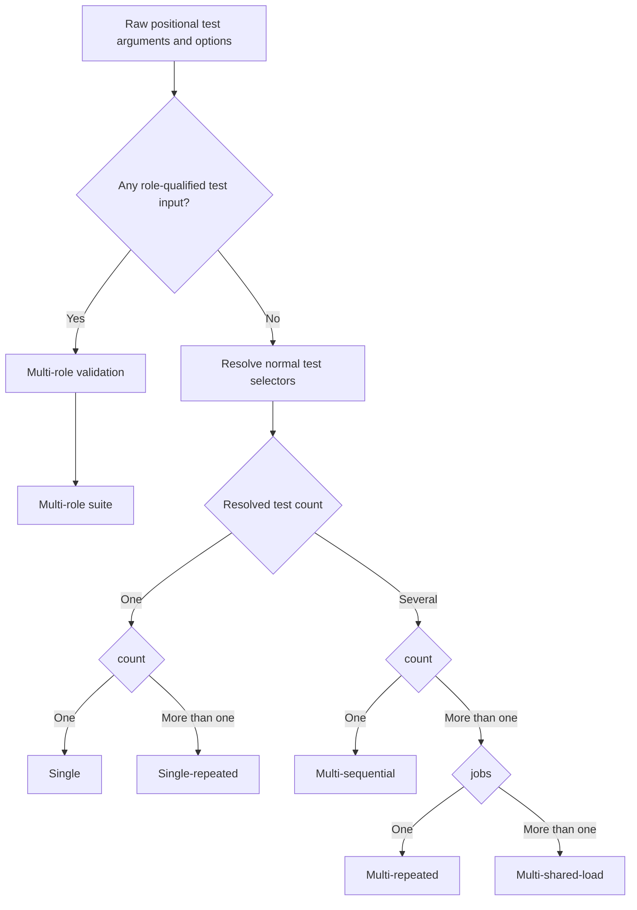

```mermaid
flowchart TD
    A[Raw positional test arguments and options] --> B{Any role-qualified test input?}

    B -->|Yes| C[Multi-role validation]
    C --> D[Multi-role suite]

    B -->|No| E[Resolve normal test selectors]
    E --> F{Resolved test count}

    F -->|One| G{count}
    G -->|One| H[Single]
    G -->|More than one| I[Single-repeated]

    F -->|Several| J{count}
    J -->|One| K[Multi-sequential]
    J -->|More than one| L{jobs}

    L -->|One| M[Multi-repeated]
    L -->|More than one| N[Multi-shared-load]
```
